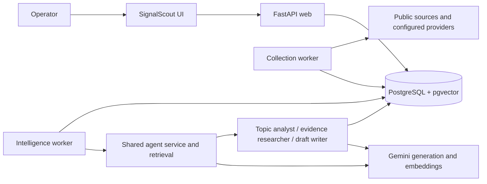

# How we built SignalScout during AI-assisted coding training

**Training stages:** spec-driven development and greenfield projects → AI agents → RAG  
**Project records:** September 29–October 3, 2026  
**Repository:** [ModernPath/signal-scout](https://github.com/ModernPath/signal-scout)

## Overview

We developed SignalScout as a practical exercise in three stages of AI-assisted coding. The starting product was a local application for discovering and reviewing signals from multiple sources. We then added independent intelligence agents, integrated their capabilities into the application, and added retrieval-augmented generation (RAG) to connect their work to previous company content and research evidence.

The operator supplied product goals, architecture constraints, implementation requests, and corrections based on the running application. The coding assistant translated those instructions into specifications, code, tests, migrations, and browser checks. Requests such as “build it full e2e” and the screenshot showing zero results pushed the work beyond individual components toward a usable demo.

This document combines six exported sessions supplied in the project root, the current conversation, and the repository's specifications and acceptance records. The exported sessions supply the original greenfield and agent-template prompts that were missing from the first version of this overview. It remains an overview rather than a verbatim transcript. Session activity sometimes overlaps, so the narrative follows development milestones rather than claiming an exact message-by-message chronology. Test counts below are historical results, not new test executions for this document.

| Training step | What we built | Main learning |
|---|---|---|
| 1. Spec-driven development and greenfield projects | Monitoring, collection, a deduplicated signal feed, and persistent triage | Give the assistant an explicit product contract and verify observable behavior. |
| 2. AI agents | An independent intelligence agent with tools, skills, memory, and specialist subagents; then application integration | Agent architecture needs shared services, durable state, boundaries, and usable interfaces. |
| 3. RAG | Company-content and research retrieval, cited angle refinement, and draft provenance | Retrieval needs source lifecycle, evaluation, and evidence controls as well as embeddings. |

## 1. Spec-driven development and greenfield projects

### Your first prompts: agree the scope through a prototype

The first exported session starts with an existing draft PRD and your request:

> “Can you draft me an html UI proto with mock data about this prd '/Users/pasivuorio/training/signal-scout/specs/phase-1-prd.md'. Create it on specs/design folder. It's just to agree the scope of the app, not final implementation.”

The initial clickable prototype included Feed, Trends, Monitoring, and Collection. You opened it in the browser, then narrowed the product:

> “drop the trends page for now, let's have mvp only”

After approving the revised UI, you asked to update the PRD and write the architecture, specifying:

> “I want it to be simple, but at least utilise Postgresql database. You can choose the rest of stack.”

The resulting scope was three screens, one local operator, and a compact Python/PostgreSQL stack. Trends and exports were deferred. The supplied exports begin at prototype creation; they do not show the original creation of the draft PRD.

### Your prompts: make the development process repeatable

You asked:

> “Let's invent two new skills: spec-driven-development and test-driven-development”

> “put them on this project”

You then defined the feature-document layout, requesting `technical_spec`, `task_spec`, and `test_plan`, and made the workflow persistent:

> “Create AGENTS.md that enforces these processes on every task or prompt we do.”

There was an instructive correction. The assistant initially moved the whole product specification and prototype into one feature folder. You clarified:

> “You removed my prd and architecture spec in favor of the feature spec, please restore those + design into main specs folder! Features must be smaller under main specs/features”

The documents were restored and the project instructions updated. This established the distinction between product-wide decisions and smaller feature contracts.

### Starting with the product contract

The first phase established SignalScout as a local application for one trusted operator. Its purpose was to help a content or communications lead find timely conversations across scattered sources.

We kept the product requirements in [the Phase 1 PRD](specs/phase-1-prd.md), the technical decisions in [the architecture document](specs/architecture-tech-stack.md), and the shared UI reference in [the design prototype](specs/design/index.html). Smaller features received their own task specification, technical specification, and test plan.

The project workflow made the development loop explicit:

1. Review the specification against the current implementation and resolve drift.
2. Write a meaningful failing test for the next behavior.
3. Implement the behavior and verify the test passes.
4. Review the feature and repair issues.
5. Check the running application in a browser and record acceptance evidence.
6. Reconcile the specification with implementation decisions.

The repository's `AGENTS.md` and local skills made this workflow persistent across requests. They gave the coding assistant instructions about how to work, alongside specifications describing what to build.

### Your prompts: build the core before the features

You requested an Application Core task/spec based on the architecture, followed by:

> “Implement '/Users/pasivuorio/training/signal-scout/specs/features/application-core' using tdd”

The first core build provided FastAPI, an idle worker, PostgreSQL, migrations, Compose startup, and health checks. Its recorded initial gate passed 11 tests, including safe database-failure responses and restart persistence.

The assistant initially served the approved mock-data prototype from the real application. You spotted the mismatch, asked whether the UI was final or a prototype, and corrected it:

> “I don't want the prototype running in app, it must be the core-application only, where we add in features!”

A failing root-page test then drove the change to a minimal core page with real database health. The prototype remained a design reference. This correction made the difference between demonstrating proposed scope and implementing functioning features explicit.

### Your prompts: review in a separate context

You created the third project skill, `feature-review`, asking it to check specification and test coverage, prototype/UX alignment with browser screenshots, security/privacy and OWASP Top 10, architecture, and feature-specific risks.

You requested the core review and then clarified:

> “just continue the implementation, I will run review in clean context session”

A separate exported review session starts with:

> “$feature-review run review for '/Users/pasivuorio/training/signal-scout/specs/features/application-core'”

That review identified an origin guard trusting an attacker-controlled Host header and insufficient dependency locking. Follow-up work added local-host restrictions, safe unexpected errors, hashed dependency locks, and dependency updates after an audit found advisories. Regression tests reproduced the defects before their fixes. Subsequent recorded gates grew to 28 and then 36 tests as work continued, with browser/prototype limitations still documented.

### Building the first application

The greenfield application delivered three main screens:

- **Monitoring:** save topics, keywords, people, competitors, and source selections.
- **Collection:** run a manual refresh and inspect source results, failures, and recent runs.
- **Signal feed:** review grouped signals, filter results, inspect provenance, and independently save, mark interesting, or dismiss items.

Sources included X, web/news, Hacker News, Reddit, GitHub, and RSS/API feeds. Availability depended on configuration and approved access; selecting a source did not guarantee it could run.

The implementation used FastAPI, browser JavaScript, PostgreSQL, Alembic migrations, and Docker Compose. A separate collection worker handled external requests. The database stored monitoring configuration, collection runs, source items, grouped signals, and triage state. Collection could run after the first eligible profile save, on a four-hour schedule, or on manual request.

### What verification taught us

Early checks covered persistence after reload, duplicate grouping, pagination, independent triage actions, partial source failure, safe error messages, and desktop/mobile usability. Browser review also exposed issues that API tests alone would not catch, including stale JavaScript, focus restoration, and copy labels.

Some initial prototype comparisons were blocked by the browser environment. Acceptance records documented that limitation instead of treating those checks as completed. Later reviews used matching desktop and mobile viewports with saved screenshots.

**Training takeaway:** specs, automated tests, and browser acceptance served different purposes. Each contributed evidence about whether the requested product actually worked.

## 2. AI agents

### Preparing a reference architecture: your template corrections

Before building SignalScout's intelligence agent, you asked to turn `agents/homework-coach-agent` into a general template:

> “can you make '/Users/pasivuorio/training/signal-scout/agents/homework-coach-agent' just a template for agents, nothing specific”

The assistant first produced a generic scaffold. You asked for reference implementations and then challenged the empty architecture:

> “i think should have some reference implementations”

> “no skills, no memory, no tools?”

Runnable references, tools, opt-in memory, and a skill were added, but the result still did not meet your expectation. You supplied a new `agents/example-agent` and asked whether the top-level instructions explained its process. They still pointed to the old template. Your follow-up was:

> “ok, so fix them”

The agent documentation was rewritten around the new example's core, service, chat, tools, skills, memory, and subagents. Copy instructions excluded stored notes, local environment files, and caches. API/UI defaults were restricted to localhost. The recorded example-agent verification passed 63 tests, including browser journeys.

You also requested `.env.example` and a separate `agent-example` repository under ModernPath, then explicitly requested public visibility. [ModernPath/agent-example](https://github.com/ModernPath/agent-example) became the independent reference repository. The core-review session also records running its offline Notes/Chat UI and verifying “list notes.”

This preparatory work explains why your later intelligence-agent prompt specified `example-agent` as the architecture to follow.

### Using agents for the coding workflow itself

A separate session introduced development subagents:

> “Can you create subagents for review and spec phases that would utilise '/Users/pasivuorio/training/signal-scout/.codex/skills/spec-driven-development''/Users/pasivuorio/training/signal-scout/.codex/skills/feature-review'”

You then requested:

> “Can you run review agents for every spec at '/Users/pasivuorio/training/signal-scout/specs/features' in parallel”

The assistant created spec/review agent definitions and ran reviews of five feature folders, with up to three reviews in parallel. These were coding-workflow agents, separate from the application's intelligence subagents.

The reviews reported concrete gaps at that development snapshot: inconsistent Unicode duplicate validation, malformed provider items failing a source batch, missing historical run details, disappearing historical topic filters, a failed feed load advancing its review marker, and incomplete intelligence chat/interface and retention behavior. The intelligence review found old replaced private content still stored and research excerpts missing expiry timestamps. Later feature records document the implemented chat surfaces, deletion scrubbing, and retention checks; the earlier findings remain useful evidence of what review caught during development.

### Your prompt: build an independent intelligence agent first

You introduced the next phase with:

> “Let's plan next phase to our application. Let's first build an independent agent to '/Users/pasivuorio/training/signal-scout/agents' folder before integration to actual signal-scout UI. Still utilise applications postgres as the main database also for the agents.”

You explicitly requested the spec-driven skill and listed the intelligence capabilities:

- Cluster related signals into conversations or topics.
- Rank opportunities by relevance, velocity, novelty, and company point-of-view fit.
- Explain “Why now?”, “Why us?”, and “What’s our angle?”
- Compare opportunities with previous company content and identify fresh angles.
- Research promising topics and summarize evidence.
- Generate LinkedIn/X post and reply drafts from selected opportunities.

You then specified the implementation pattern:

> “Please plan the whole agent according to the architecture of the '/Users/pasivuorio/training/signal-scout/agents/example-agent', utilising it's folder structure, memory, skills, subagents etc.”

This established two important constraints: the agent needed to remain independently runnable, and its memory needed to use the application's PostgreSQL database.

### From architecture to end-to-end implementation

Your next prompts moved the work into implementation and real-provider verification:

> “build it full e2e”

> “Test it with real gemini key”

> “try now, replace the API key”

We built `agents/signal-intelligence/` using the example agent's structure. CLI, chat, tools, API, and UI interfaces called a shared intelligence service. Core analysis and ranking remained deterministic; specialist subagents handled topic analysis, evidence research, and drafting. Skills described their responsibilities, and PostgreSQL held company context, opportunities, research, drafts, and chat memory.

The implementation included bounded provider calls, structured output validation, safe failure states, and explicit evidence gates. Missing velocity history appeared as unknown. Drafts required complete research and remained unpublished.

Real Gemini checks uncovered problems that controlled test providers could not establish on their own:

- An ambiguous organization name produced grounded research about the wrong organization. Research completion was tightened to require confirmation of an original signal source.
- Grounding citations arrived as Google redirect URLs. A bounded resolution step produced direct publisher URLs.
- Some generation responses were truncated or exceeded X's character limit. Output budgets and channel instructions were adjusted.
- A reply implied prior conversational context that had not been supplied. Reply instructions were corrected, while human editorial review remained necessary.

Successful later checks saved grounded research and all four LinkedIn/X post and reply formats using public fixture material.

### Your prompt: integrate it into the application

You then identified the usability gap:

> “Ok, let's integrate this to the actual UI. Don't seem I can do anything with this”

We added **Opportunities** and **Company context** to the main application. The operator could save a brief and previous content, analyze signals, select an opportunity, research it, generate a draft, edit a revision, and copy the text.

Slow operations ran through PostgreSQL-backed intelligence jobs and a separate intelligence worker. The main web process received capability flags rather than Gemini credentials. The standalone interfaces continued to use the same service and database.

**Training takeaway:** an independently functioning agent still needed application workflows, clear states, and shared persistence before it became useful to the operator.

## 3. RAG

### Your prompts: bring in a reference and plan retrieval

You introduced RAG with:

> “https://github.com/ModernPath/rag-example can you clone this repo on the root and make it a git submodule for the repo?”

> “Ok, can we plan how could we include rag in our application?”

> “ok, lets build this”

We added `rag-example` as a Git submodule and used it as a reference. The application implementation did not import its runtime or introduce a separate memory database.

The RAG feature addressed a specific product need: retrieve relevant original passages from previous company content and stored research, then use those passages to explain repetition, propose angles, and support drafts.

### Building retrieval into the existing architecture

We extended the application's PostgreSQL database with pgvector, original-text chunks, embeddings, retrieval records, and source/version provenance. Gemini embeddings supported semantic retrieval; lexical retrieval remained available without provider access. Hybrid retrieval combined the two.

The feature was delivered across three connected areas:

1. **Company knowledge:** index previous company content and inspect retrieved passages.
2. **Angle refinement:** compare an opportunity with prior claims and save cited company-specific reasoning.
3. **Research-grounded drafting:** retrieve evidence from the selected research snapshot and preserve draft source references.

Company content supplied editorial history and voice. Research supplied factual evidence. Separate citation roles helped keep those uses explicit, and generated drafts were excluded from the knowledge corpus to avoid feeding model output back as evidence.

Indexing reused the existing intelligence worker and job architecture. Source edits, deletion, expiry, changed embedding configuration, and chunker versions had defined lifecycle behavior. Stale work could not commit against changed sources. Failed replacements preserved valid existing vectors, and incomplete coverage remained visible.

The rollout included a database backup/restore check and migration verification before updating the running application.

### Evaluating RAG

The recorded RAG regression gate passed **98 application tests** and **47 standalone-agent tests**. A fixed twenty-query evaluation using real embeddings achieved **18/20 hybrid top-five hits**, compared with **17/20 lexical hits**. That small fixture measured retrieval on the chosen examples; it did not establish general superiority.

A separate synthetic end-to-end run exercised indexing, semantic passage retrieval, cited refinement, grounded research, and an X draft with real Gemini calls. Browser checks covered knowledge controls, passages, draft sources, editing, copying, source removal, and mobile layout.

These checks verified the technical path. They did not prove that every generated claim was supported or that every proposed angle was editorially fresh. Representative company-content comparisons and human review remained acceptance inputs.

**Training takeaway:** a usable RAG feature required indexing lifecycle, retrieval evaluation, provenance, and failure handling alongside generation.

## Demo hardening: your feedback changed the result

### The zero-results screenshot

After implementation, you challenged the running demo:

> “you have not really tested, zero results from every source? Make it now work e2e so we can demo this”

The screenshot exposed an empty monitoring profile combined with misleading “complete” source statuses. Some adapters had made no requests at all. We repaired setup validation, collection eligibility, and unavailable states. Public-source batches were also persisted before slower model searches, and collection-screen reload behavior was fixed.

We configured an actual monitoring profile and public RSS feed rather than inserting fabricated signals. A recorded manual run completed across all five enabled sources; Reddit stayed disabled without approved access. The feed reached **106 real linked signals**, analysis produced **77 opportunities** from the then-current feed, and real Gemini research completed with six cited evidence records for a selected opportunity.

The application regression gate reached **102 passing tests**, with populated desktop/mobile browser checks. Live refinement and drafting using the demo's company documents remained pending at that point because approval for transmitting those documents had not been granted. Earlier synthetic verification was recorded separately.

That approval was given on October 5, 2026:

> “yes, send to gemini and commit / push.”

The first live refinement failed. Gemini rejected the request because the response schema listed every company-passage sentence as an allowed value, which the short synthetic context had never exposed. The fix was test-driven: the prompt now numbers the original sentences and the model selects a prior claim by number. Refinement and LinkedIn and X drafts then completed through the application queue for the researched opportunity, with **110 application tests** passing. The output was technically valid but editorially thin, so human review remains an acceptance input.

### Making agent work visible

You then asked:

> “Could we still add some sort of chat that demoes the agents in more prominent way? It's a bit hard to detect what is agentic here, which is of course a good thing because they should converge”

You approved implementation with:

> “ok do that”

We added a prominent **Agent workspace** to the main navigation: persistent conversations, suggested prompts, selected-opportunity context, clickable results, and actual tool/subagent activity. It reused the existing service and queue.

The activity view recorded real tool start, completion, and failure events. It gave the demo an observable execution history while keeping ordinary opportunity and drafting workflows available.

The recorded final gate passed **109 application tests** and **47 standalone-agent tests**, plus JavaScript and desktop/mobile browser checks. A real Gemini turn through the main application queue called `list_opportunities` and returned linked ranking results. That live chat smoke established tool execution and persistence; it did not establish new live research or drafting quality.

## Publishing the result

Your final repository request was:

> “thanks, let's also make public repo of this whole signal scout under pomernpath”

The available organization and existing repositories identified **ModernPath** as the intended owner. We created [ModernPath/signal-scout](https://github.com/ModernPath/signal-scout) and pushed the application, independent agents, specifications, skills, migrations, and tests to `main`.

The publication scan covered 219 source/documentation files. Known credentials, environment files, database dumps, and runtime memory were excluded. `rag-example` remained a public submodule, while the agent source was included directly in the application repository.

## The application we ended up with

SignalScout now connects monitoring, collection, triage, opportunity analysis, company knowledge, research, drafting, and agent chat through one application database. Independent agent interfaces remain available. The deployment is still designed for a trusted local operator, and drafts are never automatically published.

The training progression was cumulative: specifications established the application contract; agents added intelligence behind shared interfaces; RAG connected that intelligence to retrievable sources. Your corrections then tested whether those capabilities were usable and visible in the real demo.

## Exported sessions used for this revision

The filenames identify the supplied source transcripts. The raw exports are kept locally and are not published in the repository. Labels below describe their content; some contain work extending beyond their apparent session title.

| Export | Main contribution to this history |
|---|---|
| Prototype and scope session (`codex-session-01a0ebf8-0c9d-7c23-a433-dfa2c18d6fc6.md`) | Prototype request, removal of Trends, stack choice, skills, AGENTS.md, corrected spec hierarchy, core planning |
| Application core implementation (`codex-session-01a0ec34-0dcc-75e0-a6e8-7a26896126f3.md`) | TDD implementation, startup, removal of the mock prototype from the app, clean-context review request |
| Feature-review skill (`codex-session-01a0ec3c-222a-7512-9dcf-9695a5b0f41d.md`) | Review contract covering acceptance, browser/design, security, architecture, and feature risks |
| Core review and example-agent startup (`codex-session-01a0ec4a-d619-7f70-b8af-b8341a886d5a.md`) | Host/dependency/error findings, follow-up repairs, running the example agent |
| Feature completion and agent-template evolution (`codex-session-01a0ec5a-4e54-7882-832c-f13c4c33c599.md`) | Phase 1 acceptance work, template iterations, your replacement example, documentation repairs, public agent repository |
| Spec/review subagents (`codex-session-01a0f669-337e-7581-a131-d2217d896ebd.md`) | Phase-specific coding agents and parallel feature review findings |

The current conversation supplies the independent intelligence-agent, main UI integration, RAG, live-demo repair, Agent workspace, and whole-application publication prompts quoted above. The supplied exports do not contain a separate transcript of the original PRD-writing session, if one existed.

## Evidence and further reading

- [Product requirements](specs/phase-1-prd.md), [Phase 2 requirements](specs/phase-2-prd.md), and [architecture](specs/architecture-tech-stack.md).
- [Feature index](specs/features/README.md) and [development loop](specs/dev-loop.md).
- [Standalone-agent acceptance](specs/features/intelligence-agent/acceptance_results.md) and [main UI acceptance](specs/features/intelligence-ui/acceptance_results.md).
- [RAG acceptance](specs/features/company-knowledge-rag/acceptance_results.md).
- [Collection and live demo repair](specs/features/signal-collection/acceptance_results.md).
- [Agent workspace acceptance](specs/features/agent-workspace/acceptance_results.md).

Temporary screenshot and live-run paths referenced in those records are local evidence locations; the public repository does not contain the private database backups or every temporary artifact.
