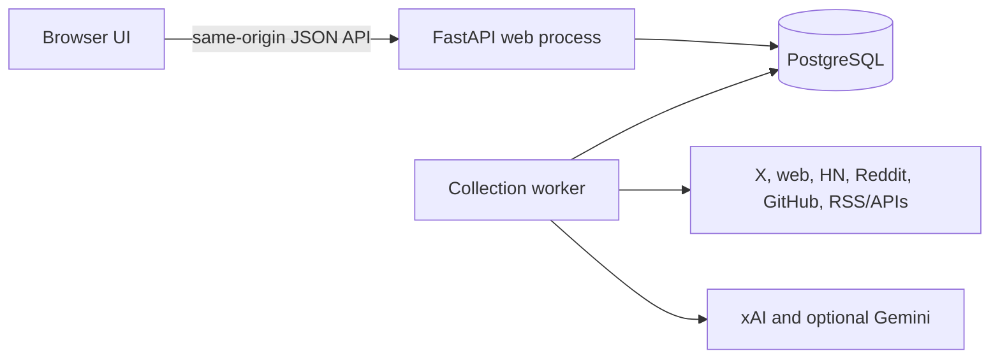

# SignalScout — MVP architecture and tech stack

**Status:** Implemented Phase 1 and guided Phase 2 application integration; acceptance evidence is in the feature folders  
**Product scope:** [Phase 1 MVP PRD](phase-1-prd.md)  
**UI reference:** [Approved HTML prototype](design/index.html)  
**Last updated:** 2026-09-29

## Architecture decision

Build one Python codebase with three long-running local services: a FastAPI web process, a collection worker, and PostgreSQL. A one-shot migration task prepares the database before web and worker start. The web process serves the three functional screens and their APIs. Both Python processes share source normalization and persistence code. PostgreSQL holds the profile, run history, source items, signals, and triage state.

This avoids a frontend build system, Redis, and a separate queue while keeping slow external calls out of web requests. FastAPI can [serve static files](https://fastapi.tiangolo.com/tutorial/static-files/) and define validated [response models](https://fastapi.tiangolo.com/tutorial/response-model/). Its [background task guidance](https://fastapi.tiangolo.com/tutorial/background-tasks/) is aimed at smaller in-process work, so collection has its own worker.

## Stack

| Layer | Choice | Reason |
|---|---|---|
| UI | HTML/CSS, vanilla JavaScript, `fetch` | Build functional screens from the approved prototype as a visual reference; keep mock arrays out of the running app. |
| Web/API | Python 3.12+ and FastAPI | One small API with request validation and clear contracts. |
| Database | PostgreSQL 17+ | Persistent store with constraints, indexes, JSONB, and transactional job claims. |
| Data access | SQLAlchemy 2.x with `psycopg` 3 | Explicit PostgreSQL driver and synchronous code path for this small app. [Dialect reference](https://docs.sqlalchemy.org/en/20/dialects/postgresql.html#module-sqlalchemy.dialects.postgresql.psycopg). |
| Migrations | Alembic | Versioned database schema changes. [Official tutorial](https://alembic.sqlalchemy.org/en/latest/tutorial.html). |
| HTTP providers | Python standard-library HTTP transport and thin source adapters | Keep provider details behind one interface without another runtime dependency. |
| Local runtime | Docker Compose: `web`, `worker`, `db`, plus one-shot `migrate` | One command to run the stack locally with a persistent database volume. Compose can wait for a [healthy database](https://docs.docker.com/compose/how-tos/startup-order/). |

Pin compatible package and container versions when implementation begins; do not depend on floating `latest` tags.

## Deployment and process behavior

- **Local-only MVP:** Publish the web port on `127.0.0.1`, keep PostgreSQL private to Compose, and assume one trusted operator. Hosting or shared access requires authentication and a separate deployment design.
- **Web process:** Serves `/` and static assets, reads and writes PostgreSQL through the API, and does not call slow source APIs during a request.
- **Worker process:** Polls queued jobs, schedules one run every four hours, executes enabled source adapters, and persists source results and status. Deploy exactly one worker instance for the MVP.
- **Migrations:** A one-shot Compose task runs Alembic before web and worker start, after the database health check passes.
- **Time:** Store UTC timestamps and render local time in the browser. Use fixed four-hour UTC slots for scheduled jobs.
- **First run:** Saving a non-empty profile for the first time queues collection immediately, independent of the next scheduled slot.

## API contract

All endpoints use JSON except the static UI. Mutations require a same-origin request; local binding is not a substitute for validation.

| Endpoint | Purpose |
|---|---|
| `GET /api/profile` | Profile rules, source toggles, and schedule. |
| `PUT /api/profile` | Replace the singleton profile atomically after validation. |
| `GET /api/signals` | Paginated feed; `source`, `topic`, `from`, `to`, `min_engagement`, and `state` filters; newest first. |
| `GET /api/signals/{id}` | Detail, matched rules, metrics, and contributing source items. |
| `PATCH /api/signals/{id}/state` | Set saved, dismissed, and interesting flags. |
| `GET /api/summary` | Feed counts and last review time for the top cards. |
| `POST /api/feed-reviewed` | Record that the current feed has been displayed so the next visit can count new signals. |
| `GET /api/collection-runs` | Recent runs with per-source status and safe error summaries. |
| `POST /api/collection-runs` | Queue manual collection; return an existing active run if one exists. |
| `GET /api/health` | Process and database readiness. |

Use bounded pagination (for example, 50 signals per page). Return stable IDs and ISO 8601 timestamps. Show useful empty states when no source is available or no signal matches the filters.

For a grouped signal, use the most recently published linked source item as its displayed timestamp and primary metric; when publication times tie, prefer an item with a metric. A source filter matches any linked source item, while the engagement filter uses that displayed primary metric. Capture the previous `last_reviewed_at` before recording a new feed view so the “new since last visit” card remains stable during that visit.

## PostgreSQL data model

| Table | Important fields and constraints |
|---|---|
| `monitor_profile` | Singleton ID, created/updated timestamps, last reviewed timestamp. |
| `monitor_rule` | Profile ID, kind (`topic`, `include`, `exclude`, `competitor`, `person`), value, normalized value; unique `(profile_id, kind, normalized_value)`. |
| `source_config` | Profile ID, source key, enabled flag; unique `(profile_id, source_key)`. No credentials. |
| `collection_run` | ID, trigger (`initial`, `scheduled`, `manual`), status (`queued`, `running`, `complete`, `partial`, `failed`), optional unique scheduled slot, profile snapshot JSONB, queued/started/finished timestamps. |
| `source_run` | Run ID, source key, status (`complete`, `failed`, `unavailable`, `skipped`), hit/accepted/error counts, started/finished timestamps, safe error code/message. |
| `source_item` | Source key, stable external ID (or source URL hash when no ID exists), source URL, canonical content URL, title, snippet, published time, metric name/value, fetched time, linked signal ID; unique `(source_key, external_id)`. |
| `signal` | ID, canonical URL key, title, snippet, published time, created/updated timestamps. The primary source is derived from linked source items. |
| `signal_topic` | Signal ID and matched topic text; unique pair. Keeping the matched text preserves historical feed topics when the monitoring profile is replaced. |
| `signal_state` | Signal ID (unique for this one operator), saved/dismissed/interesting booleans and their timestamps. |

Index `signal(published_at DESC, id DESC)`, `source_item(signal_id, source_key)`, `signal_topic(topic, signal_id)`, and `collection_run(queued_at DESC)`. Use migrations for constraints; do not rely on application checks alone.

## Collection pipeline

1. **Create run:** A scheduled slot or manual request inserts a queued run. The API returns quickly. If a run is queued or running, manual refresh returns that run instead of enqueueing another.
2. **Build queries:** Expand saved topics, include/exclude terms, competitors, and people into a bounded set of source-specific searches. Disabled sources are skipped.
3. **Fetch:** Each adapter returns normalized candidate items with a stable URL and provenance. Enforce per-source timeouts, pagination caps, and retries only for transient failures.
4. **Filter and enrich:** Apply exclude rules first, attach matched topics, and optionally ask Gemini to classify borderline web results or extract structured page fields. Validate model output and keep its cost budget small.
5. **Deduplicate:** Upsert `(source_key, external_id)`. Resolve a canonical content URL by stripping known tracking parameters and honoring a trusted canonical link where available. Match an existing signal by canonical URL; otherwise use normalized title plus target host and a short published-time window. If uncertain, keep separate signals. Every source item remains linked to its signal.
6. **Persist and report:** Commit successful source batches, update feed records, and record counts and safe errors per source. Mark the run complete, partial, or failed based on those outcomes.

Do not create a feed item from an AI-written answer alone. xAI's documented [Web Search](https://docs.x.ai/developers/tools/web-search) and [X Search](https://docs.x.ai/developers/tools/x-search) tools can discover current items; the adapter must extract and retain real source URLs. Gemini supports [structured output](https://ai.google.dev/gemini-api/docs/structured-output), which should be schema validated after receipt.

### Source adapter plan

| Source | Adapter plan | Availability rule |
|---|---|---|
| X | xAI X Search for recent matching public posts. | Requires configured xAI key and permitted use. |
| Web / news | xAI Web Search for discovery, page fetch where permitted, optional Gemini extraction. | Requires configured xAI key; Gemini failure should not discard otherwise usable items. |
| Hacker News | Read recent items from the [official HN API](https://github.com/HackerNews/API), then match locally; the API is not a keyword search service. | Available without a key, subject to normal request limits. |
| Reddit | Use approved Reddit API access to search posts and comments for the saved terms; no subreddit configuration UI. | Mark unavailable if credentials or permission are missing; do not scrape as a fallback. [API terms](https://redditinc.com/policies/data-api-terms). |
| GitHub | Use REST search for public repos and issues; with a token, query up to two found repositories for public discussions through GraphQL. | Respect API limits; token is optional for REST. A discussion lookup failure retains REST results. [GitHub REST docs](https://docs.github.com/en/rest/using-the-rest-api). |
| RSS / selected APIs | Poll configured RSS URLs; add a named API adapter only when its key and contract are known. | A missing feed list or API key disables only that source. |

## Failure, cost, and security rules

- A source timeout or unavailable credential records a source-level error. Successful sources still publish results. Previously stored results stay visible with their original timestamps.
- Store only safe error codes and summaries in PostgreSQL and the UI; redact headers, tokens, query secrets, and provider payloads from logs.
- Keep provider keys in local `.env` or deployment secrets, never in PostgreSQL or browser responses. Required: `DATABASE_URL`. Optional by source: `XAIGROK_API_KEY`, `GEMINI_API_KEY`, `GITHUB_TOKEN`, approved Reddit credentials, and `RSS_FEED_URLS`. Provide `.env.example` with names and no values.
- Budget external queries per source and run, retry transient failures at most once, and use published-time cursors where providers support them. Record request counts and duration per source run. There is no cross-run search cache in this local MVP.
- Treat fetched content as untrusted data. Escape it in the UI, validate URLs before linking or fetching, and never obey instructions embedded in source content.
- Reject cross-origin mutating requests and bind only to localhost for the MVP. Do not expose this no-auth build on a public interface.
- Before shipping each connector, confirm its current API access, rate limits, and retention terms. Retain normalized metadata and snippets needed for the feed rather than full external payloads by default.

## Build sequence

1. Build the [Application Core](features/application-core/task_spec.md): shared Python package, Compose services, PostgreSQL connection, migrations, minimal core page, health endpoint, and idle worker entry point.
2. Add the Monitoring profile tables and API together with the minimal Collection run table needed for first-run enqueue.
3. Add Feed storage, deduplication, filters, detail, and triage using fixed source-item fixtures; connect the UI to the API.
4. Add the Collection worker loop and one source adapter end to end.
5. Add remaining source adapters, per-source status, partial failures, and the four-hour schedule.

The MVP is ready when the [PRD acceptance criteria](phase-1-prd.md#functional-acceptance-criteria) hold with configured source access. Detailed work is listed in the [feature index](features/README.md). Trend computation, a frontend framework, Redis/Celery, user accounts, and hosted deployment are outside this architecture.

## Phase 2 boundary

The [Phase 2 PRD](phase-2-prd.md) and [standalone intelligence agent spec](features/intelligence-agent/technical_spec.md) extend this local stack after the MVP. The independent agent under `agents/` follows the complete example-agent architecture, including its own chat, tools, subagents, local API, and local UI. It uses application-owned Alembic migrations and the same private PostgreSQL database. Integration into the SignalScout application web/UI is later. Phase 1 feed behavior and the three existing screens remain governed by this MVP architecture.

## Phase 2 application integration

The [intelligence UI feature](features/intelligence-ui/technical_spec.md) adds Opportunities and Company context to the main web process. It reuses `agents/signal-intelligence` service and PostgreSQL memory through a repository-local bridge. A dedicated `intelligence-worker` drains a bounded PostgreSQL job queue; only that worker receives Gemini credentials. Context CRUD, evidence inspection, and editorial draft revisions stay synchronous; analysis/research/drafting return queued status promptly. The original collection worker retains its own queue. All main UI calls remain same-origin, and publishing is excluded.

## Company knowledge retrieval

The [company knowledge RAG feature](features/company-knowledge-rag/technical_spec.md) implements pgvector plus PostgreSQL full-text search in the same application database. Text, chunks, embeddings, indexing lifecycle and retrieval provenance remain under application-owned migrations and shared agent memory. The existing intelligence worker performs bounded embedding and generation jobs; the web process retains key-free same-origin APIs. The pgvector 0.8.7 image is pinned by digest and retains PostgreSQL 17 and its existing volume.

`rag-example/` is a pinned Git submodule used as a design reference and independent experiment. Its Chroma storage, managed File Search store, example UI and JSON sync state are not application runtime dependencies. The plan retains deterministic analysis, labels lexical fallback and incomplete coverage, and separates company editorial context from factual evidence. This architecture extension is implemented; acceptance evidence is recorded in the feature folder.

## Agent workspace

The [Agent workspace](features/agent-workspace/technical_spec.md) adds queued conversational orchestration to the main application. Existing chat memory stores sessions and turns; intelligence jobs and persisted tool events expose actual execution and artifact links. The worker uses shared service tools and a bounded Gemini function-call loop; web stays key-free. Selected-opportunity gates apply to research/refinement/drafts. Session expiry/deletion cascades associated chat jobs and activity. Guided screens remain available.
