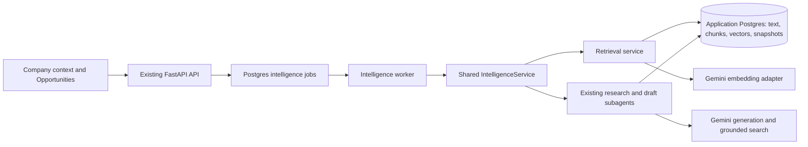

# Company knowledge RAG — technical specification

**Status:** Implemented, 2026-10-02. The implementation decisions below supersede differing details in the original design proposal.

## Architecture choice

Use PostgreSQL + pgvector with PostgreSQL full-text search. Keep the existing FastAPI/vanilla JS UI, shared IntelligenceService, PostgreSQL memory, and dedicated intelligence worker. The example submodule at `rag-example/`, pinned to `18c315782b46bee504fc0bc6d990aeedf0af8412`, is an architectural reference for chunk → embed → store → retrieve → cited generation.

The example's scratch engine stores vectors in local Chroma; its File Search engine uses a managed remote store and local JSON sync state. Implement our own Postgres adapter and lifecycle contracts. Keep the submodule separately runnable and avoid runtime imports from it. No license file was found in the checkout; establish reuse rights before copying code.

[pgvector](https://github.com/pgvector/pgvector) supports exact cosine search and integration with PostgreSQL full-text search. Begin with exact search for the bounded local corpus; introduce HNSW only after measuring a concrete latency problem and filtered retrieval recall. Combine lexical and semantic candidate ranks with reciprocal rank fusion, deduplicate overlapping chunks, and cap passages per document. Do not treat fused ranks as probabilities.

[Gemini embeddings](https://ai.google.dev/gemini-api/docs/embeddings) are a proposed provider. Start with `gemini-embedding-2` and 768 dimensions, subject to live access verification. Validate per-input output count, finite values, dimensions, normalization, batching semantics, and query/document formatting against official documentation. Keep generation model independently configurable; do not inherit example generation-model defaults. [Managed File Search](https://ai.google.dev/gemini-api/docs/file-search) remains an alternative for later evaluation; it would add a remote lifecycle and synchronization boundary.

## Agent folder additions

Under `agents/signal-intelligence/`, add `intelligence_retrieval.py` for use cases and candidate assembly, `intelligence_embeddings.py` for bounded provider calls, `memory/knowledge.py` for persistence, `tools/search_knowledge.py` for inspection, and `skills/company-knowledge.md` for source roles and citation requirements. Extend existing topic/research/draft subagents; no new orchestrator or duplicate memory store. Pass IDs/limits over the existing bounded subprocess contract. Subagents load validated retrieval records from PostgreSQL. Extend the environment allowlist only for required retrieval settings.

## Proposed persistence

| Record | Required fields/behavior |
|---|---|
| `knowledge_document` | Corpus kind, source record FK, source version/hash, title, URL, publication/retrieval time when available, eligibility state, index generation, safe error. Separate explicit FKs/checks for company content and research evidence. Brief rules remain authoritative structured inputs, not retrieved fragments. |
| `knowledge_chunk` | Document/version, ordinal, original passage, heading path and character offsets, hash, full-text representation. Original wording is retained; model summaries are not replacement evidence. |
| `knowledge_embedding` | Chunk FK, embedding configuration ID, `vector(768)`, ready status, creation time. Config identifies provider/model/dimensions/input format. Changed dimensions need a migration or separately typed table. |
| `knowledge_index_generation` | Corpus snapshot, chunker/embedding versions, ready/partial/failed state, document counts and usage counters. Activate only a validated generation. |
| `retrieval_run` / `retrieval_hit` | Purpose/opportunity/research IDs, bounded query, retrieval config and corpus generation, ordered chunk/version IDs, semantic/lexical scores, selected context, mode/coverage, timestamp. Preserve the passages actually supplied until deletion/expiry redacts them. |
| `opportunity_enrichment` | Opportunity FK, brief version, retrieval/run IDs, prior claim comparisons, Why us/angle, supplied citations, model/prompt version, confidence/status. Versioned independently of deterministic scores. |

Link new drafts to their retrieval run in addition to their existing research snapshot. Factual evidence IDs and company-context chunk IDs use distinct citation namespaces and validators. Exclude generated drafts/enrichments from indexing to avoid self-reinforcing evidence. In slice 3, index stored checked research claims as claims with stance, URL, retrieval time and evidence FK; do not imply a full publisher page was fetched.

## Index lifecycle and queue

1. In the content mutation transaction, mark a source/version dirty and invalidate superseded retrieval eligibility. This is independent of provider availability or an already-active intelligence job.
2. The existing worker materializes one bounded indexing batch when the single-active intelligence queue is idle. Dirty rows are durable pending work, so content saving never fails merely because another job is active. Extend job action constraints, dispatch, safe errors, progress, and recovery explicitly; current unknown actions must not fall through to drafting.
3. Split original text at headings/paragraphs with bounded overlap; initial target 300–500 tokens, tuned by evaluation. Store chunker/config hashes. Deterministic chunking comes first; semantic boundary selection is deferred.
4. Embed changed chunks outside database transactions. Limit batches, retries, elapsed time, tokens and job spend. Commit only if source eligibility, hash/version and generation still match; otherwise discard stale results. Reuse valid vectors for unchanged inputs/configuration.
5. A failed rebuild keeps valid unchanged documents searchable, excludes outdated/deleted passages, and reports incomplete coverage. Model/config changes build a new generation; do not erase the working index before the replacement is ready.
6. Propagate source deletion and 90-day research-excerpt expiry to chunks, embeddings, query caches and retrieval excerpts. Keep minimal non-text audit identifiers/source tombstones. Mark affected outputs rather than pretending they remain fully supported.

Current stale-job recovery fails work after five minutes. Indexing must use short resumable batches under that limit or introduce tested lease/heartbeat recovery before longer jobs. Do not increase timeouts without matching recovery behavior.

## Retrieval and generation

Purpose-specific corpus filters are applied before ranking. Prior-content comparison uses active company articles/posts. Draft factual retrieval is restricted to the selected completed research snapshot; conflicting claims keep their stance. Company-context retrieval supplies voice/editorial history separately. Do not pull unrelated research into a selected opportunity merely because it is similar.

Start with at most 20 candidates per search channel and select at most 8 diverse passages under a shared prompt-token budget. Tune relevance cutoffs with our fixtures; the example's 0.6 threshold is not portable. Include title/heading, source role, version, ID, URL where present, and exact passage. Treat source text as untrusted instructions. Validate citation membership and support; an in-range citation alone does not prove entailment.

Similarity proposes prior-content candidates; a structured claim comparison returns repeated/different/uncertain with cited original passages. Deterministic numeric weights and velocity arithmetic remain unchanged. Initial semantic enrichment does not silently replace the novelty component; display semantic repetition assessment separately, and show lexical novelty as provisional when coverage is incomplete. A future score revision requires a versioned calibrated rule and separate acceptance evidence.

`analyze` may consume already-indexed retrieval in the worker, embedding opportunity queries there. Preserve a provider-free deterministic mode and label its lexical results. Add a selected `refine_angle` job for generation. Fingerprints include source versions, active corpus generation, retrieval/chunker/embedding configuration, brief, and enrichment model/prompt version. Query cache keys include corpus/filter purpose; private raw queries are not logged.

## API and UI integration

Under `/api/intelligence`, propose `GET knowledge/status`, `GET content/{id}/index`, `POST knowledge/reindex`, `POST knowledge/search`, `GET knowledge/search/{job_id}`, and `POST opportunities/{id}/refine-angle`. Slow query embeddings use queued jobs and return 202; result reads are synchronous. Add retrieval/enrichment to opportunity detail and source roles to draft metadata. Same-origin validation, bounded inputs, escaped excerpts and validated HTTP(S) links remain mandatory.

Web receives no provider key. Worker capability status distinguishes generation and embedding availability. Existing standalone CLI/API/UI call the same service; main UI is the primary acceptance surface. Present indexing/retry, previous passages, editorial comparison and sources using familiar language. Explain provider processing in Company context rather than exposing vector internals.

## Rollout

Application Alembic owns schema changes. Package a pinned pgvector build compatible with the current PostgreSQL 17 image, preserving the existing data volume and major version. Verify backup/restore and extension availability on a disposable database before the live migration. Feature flag semantic retrieval off until indexing/evaluation pass; rollback disables semantic use while keeping text/lexical workflows. Implementation uses TDD per slice and feature review including browser/prototype screenshots. Exact dependency pins, prompt budgets and calibrated cutoffs are implementation outputs to record here.

## Implementation decisions and delivered surfaces

- Migrations `0008`–`0011` create the extension, knowledge documents/chunks/embeddings, corpus revision marker, retrieval records, enrichment, separate draft retrieval FKs, deletion redaction and independently versioned chunk sets. Existing application PostgreSQL remains authoritative. `compose.yaml` pins pgvector 0.8.7/PostgreSQL 17 by image digest. A backup was restored and migrated in disposable Postgres before rollout.
- Incremental indexing activates each validated document atomically; a corpus revision/coverage report replaces the proposed separate index-generation table. Embedding configurations and chunker versions coexist, so rebuilds preserve older vectors and historical passages. A failed replacement does not erase the old index. New retrieval uses only the selected configuration and reports partial coverage.
- Default chunks are original text spans capped at 1600 characters with 160-character overlap, split at paragraphs where possible. Config identity includes model, 768 dimensions, input prefix and chunker version. Retrieval records additionally identify reciprocal-rank-fusion/cutoff/top-k version. Exact cosine search uses a 0.55 candidate cutoff, evaluated on the committed twenty-query fixture; no HNSW is needed for this corpus.
- Main web remains key-free. Provider work uses the existing single-active job queue; idle worker ticks index two documents at a time. Failed records need explicit Retry. Content mutations create pending work transactionally even during another active job. The worker performs hourly retention cleanup, while retrieval/drafting enforce expiry immediately before cleanup. No durable token-price/cost accounting was added; request/input/output/time limits bound provider work.
- Opportunity detail uses a read-only lexical preview without provider calls until selected refinement supplies hybrid retrieval. Deterministic clustering, component arithmetic and analysis fingerprints retain their existing semantics. Semantic comparison is separate enrichment, and the UI labels lexical novelty provisional. There is no semantic result cache to invalidate; each generated result records its own retrieval/config/brief/source versions.
- Refinement reuses `topic_analyst`. Structured output limits prior-claim quotes to original passages; the service validates that the quote belongs to its cited chunk. Unsupported differences become uncertain, never automatically fresh. Source versions and the brief are checked before commit. Semantic judgments still need editorial review.
- Drafts keep company retrieval and factual retrieval separately. Factual candidates belong only to the selected completed research snapshot; original evidence is a bounded fallback when its passages are not yet indexed. Expired evidence is never a fallback. Conflicting/unknown stance is passed to generation and must be qualified. Citation IDs, company IDs, length, prohibited and numeric claims are validated; semantic entailment remains a human review responsibility. Edits retain source/research/retrieval versions.
- Subagents receive the service engine's explicit database URL in their restricted environment, not an unrelated ambient URL. Main queued search/refinement/drafting and standalone CLI/API/UI/chat call the same service. Standalone legacy API/UI actions remain synchronous; the main UI is the asynchronous acceptance surface. Offline chat knowledge search forces lexical retrieval without provider calls.
- Deletion purges chunks/vectors, redacts retrieval passages/queries and stored enrichment JSON, and marks source removal. Operator-owned draft text remains, with redacted source details. There is no Chroma/file-memory/managed File Search dependency or copied example code.
- Operational rollback sets `KNOWLEDGE_SEMANTIC_ENABLED=false` and retains lexical workflows. `0011` intentionally does not destructively downgrade versioned chunk history; a full schema rollback uses the verified database backup.

Review evidence, remaining editorial limits and browser screenshots are in [acceptance results](acceptance_results.md).
