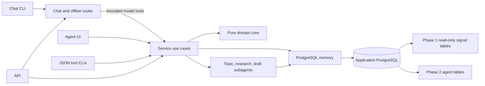

# Standalone intelligence agent — technical spec

**Behavior:** [Task spec](task_spec.md)  
**Product architecture:** [Phase 1 architecture](../../architecture-tech-stack.md)

## Process and ownership

Build `agents/signal-intelligence/` as a domain-specific adaptation of [`agents/example-agent/`](../../../agents/example-agent/). Preserve its dependency direction and full independent surface: chat CLI, JSON tool CLIs, local FastAPI, local UI, skill Markdown, PostgreSQL memory, and narrow subagent processes. Do not copy the example's notes data or JSON-file store. All interfaces call `intelligence_service.py`; chat model tools and the offline router wrap those same use cases. The agent connects to the same private Compose `db` service through `DATABASE_URL`, but does not import or change the running SignalScout web process. Its environment loader reads only the agent folder's `.env.local` and process environment, never walks parent directories for unrelated credentials.

Application Alembic migrations under `migrations/versions/` own intelligence and agent-memory tables and foreign keys. The agent checks the required schema capabilities at startup and gives an actionable migration error. Run its CLI/API/UI in separate processes or containers on the Compose network after `migrate`; publish only the agent UI/API host ports on `127.0.0.1` for local development. A container process may listen on its private interface, while the host port remains loopback-only. Do not publish the database port. Keep the SignalScout application deployment independent of this process.



## Folder map and boundaries

The filenames deliberately mirror the complete example agent. The independent implementation uses this structure, with a compatibility import shim at `intelligence_store.py` for earlier direct CLI callers.

```text
agents/signal-intelligence/
├── signal_intelligence.py         # chat CLI and explicit direct commands
├── intelligence_chat.py           # model tool wrappers and offline router
├── intelligence_service.py        # shared use cases and subagent orchestration
├── intelligence_core.py           # pure clustering, score math, validation
├── intelligence_provider.py       # bounded model and research adapter
├── agent_env.py / agent_llm.py    # scoped settings and model client
├── agent_cli.py                   # one JSON success/error envelope
├── memory/
│   ├── memory.py                  # PostgreSQL store/repository and inspection CLI
│   └── schema.md                  # table ownership, retention, data flow
├── tools/
│   ├── manage_context.py         # brief and previous-content actions
│   ├── analyze_signals.py         # conversations and ranking
│   ├── inspect_opportunity.py     # ranked detail and provenance
│   ├── research_opportunity.py    # explicit selected-topic research
│   └── draft_content.py          # LinkedIn/X post and reply drafts
├── skills/
│   ├── conversation-analysis.md
│   ├── opportunity-ranking.md
│   ├── evidence-research.md
│   └── content-drafting.md
├── subagents/
│   ├── topic_analyst.py           # label/check candidate groups
│   ├── evidence_researcher.py     # bounded retrieval and evidence report
│   └── draft_writer.py           # one channel/format draft
├── api/main.py                    # local JSON API; no public CORS
├── ui/app.py, ui/templates/        # local independent agent dashboard/chat
└── tests/                         # pure, PostgreSQL, CLI, chat, API, UI, browser
```

`memory/memory.py` replaces the example's file-backed `NoteStore` with `IntelligenceStore`. It is the single persistence adapter for service, tools, and subagents. No `memory/data/*.json` is used. Keep an inspection CLI for brief, content, runs, research, drafts, and chat sessions, with deletion limited to company context and operator-owned history. SQL migrations still live in the main application repository.

## Data model

| Table | Purpose and constraints |
|---|---|
| `company_brief` | Singleton/versioned company description, audience, expertise, POV, voice, prohibited claims, update time. Keep history or immutable snapshots for reproducible analyses. |
| `company_content` | Prior content ID, title, URL (optional for private text), publication time, channel, excerpt/text, normalized claim summary, source and content hash. Deduplicate imports. |
| `intelligence_run` | Input fingerprint, algorithm/prompt/model versions, started/finished time, status, safe failure reason, window, provider usage/cost counters. Unique successful fingerprint for idempotence. |
| `conversation` | Stable ID within an analysis version, topic label, short summary, creation/update time, confidence. |
| `conversation_signal` | Conversation ID and Phase 1 `signal.id`, match reason/confidence; unique membership within a run. Never delete the source signal. |
| `opportunity` | Conversation ID, four component scores, total, confidence, rank, Why now/Why us/angle text and cited evidence IDs, brief/content version references. |
| `research_run` / `research_evidence` | Selected opportunity, query and budget, status, retrieval time, direct source URL, claim, excerpt/summary, support/conflict/unknown label, failure reason. |
| `content_draft` | Opportunity and research version, channel (`linkedin`/`x`), format (`post`/`reply`), text, cited evidence IDs, prompt/model version, created time, status (`draft` only initially). |
| `agent_chat_session` / `agent_chat_turn` | Local conversation ID, role, bounded text, selected opportunity context, timestamps, and retention deadline. No raw model tool transcript or provider payload. |

Foreign keys to Phase 1 signals use `ON DELETE RESTRICT` or a deliberate snapshot strategy; intelligence analysis must not silently erase provenance. Index run freshness, opportunity rank, and evidence by opportunity. Store UTC times and minimal fetched excerpts. Retain brief/content and selected drafts until operator deletion; expire chat turns and fetched excerpts after 90 days while retaining citation URL, retrieval time, and run metadata. A tested cleanup command implements expiry. `0005_intelligence` creates the core agent tables and `0006_agent_memory` adds chat memory, lifecycle fields, and version fields. Not every proposed cost and prompt-history field is stored yet, as recorded in acceptance results.

## Analysis pipeline

1. Read at most a configured number of recent, non-dismissed signals (default proposal: 30 days, 500 signals), their topics, source items, and timestamps in one consistent snapshot. Record the input IDs and a hash of normalized inputs, brief/content versions, and algorithm/model versions.
2. Normalize title and snippet text, extract meaningful terms, and generate conservative candidate pairs within a time window. Group only when topic similarity and at least one specific shared entity/phrase or strong semantic evidence agree. A model may propose pairs, but the core validates IDs, thresholds, and non-conflicting evidence. Store reasons and permit future manual split/merge after UI integration.
3. Compute relevance from monitoring terms plus company audience/expertise match; velocity from distinct signal and source arrival rates in recent versus earlier windows; novelty from comparison with prior company claims and recent signal history; POV fit from the brief and cited expertise. Normalize each component to 0–100 and use versioned, configurable weights with a total of 100%. Mark missing observations as unknown and reduce confidence. Avoid arithmetic on raw likes/points/stars across providers.
4. Ask the model for a structured explanation only after evidence and numeric components are assembled. Reject invented IDs/URLs and unsupported factual assertions. Store prompt/model version and cited source IDs; deterministic fallback displays facts and missing-context notes when no provider is configured.
5. Research only selected opportunities. Start from stored source URLs, then use bounded Gemini grounded search with public-URL validation and timeouts. Resolve only Google grounding citation redirects with a non-following HEAD request; validate the public publisher URL before storing it. Separate cited segments from uncited synthesis. A result without at least one confirmed starting source URL stays partial and cannot feed a draft. Provider failure creates a safe partial record. The agent does not fetch arbitrary publisher pages.
6. Draft only from a completed research snapshot and brief. Generate each channel/format separately under length and style constraints. Validate citations and named claims against evidence; return a review-needed state for any unsupported claim. Save drafts only, with no outbound publish capability.

## Chat, skills, tools, and subagents

`intelligence_chat.py` mirrors `example_chat.py`: a bounded history, at most eight model tool calls per turn, an explicit system instruction that source material is untrusted, and Markdown skills loaded from `skills/`. Its tools are thin wrappers around service methods for context, analysis, opportunity inspection, research, and drafting. The deterministic offline router supports inspection and analysis commands; when asked for unavailable research or drafts, it returns a clear capability error. A model failure may fall back to that router, but must never silently claim research or a draft was completed. Persist only the bounded user/assistant turns in PostgreSQL; truncate input, exclude credentials, and allow session deletion.

Each skill file states purpose, when to use it, the exact service tool, evidence requirements, cost/side-effect limits, and an example. Skills are prompt guidance, not authority to change the database directly. `conversation-analysis.md` explains conservative grouping and provenance; `opportunity-ranking.md` explains component scores and unknowns; `evidence-research.md` requires source-linked claims and visible conflicts; `content-drafting.md` requires explicit selection, a complete brief, evidence, and draft-only output.

The service launches only named scripts under `subagents/` with a timeout, a small JSON stdin request containing IDs/limits, and a JSON stdout success/error envelope. It supplies only the required environment variables and does not send full private documents in command arguments or logs. The service validates every returned ID, URL, score/rationale, and text length before committing results. Each subagent has one job:

- `topic_analyst.py`: inspect bounded candidate signal groups from PostgreSQL and propose a label/summary or reject an uncertain merge; the pure core remains authoritative for membership safeguards.
- `evidence_researcher.py`: investigate one selected opportunity with approved provider search/retrieval, return claim/source/stance/failure records, and make no persistence changes itself.
- `draft_writer.py`: produce one requested channel/format variant from one immutable research snapshot and brief, with cited evidence IDs; it cannot publish.

This follows the example's service → subagent process contract while avoiding a separate database or file memory. A research subagent timeout or malformed JSON records a safe partial research status and leaves prior completed work intact. Topic labeling falls back to the deterministic title; draft errors leave existing drafts intact.

## Independent interfaces

- **Chat CLI:** `signal_intelligence.py --chat` and one-shot text queries, with `--offline` as in the example. Direct structured commands remain available for automation.
- **Tool CLIs:** one action family per script in `tools/`, sharing `agent_cli.py` envelopes (`status`, `data` or safe `error`), exit codes, and service validation.
- **Agent API:** FastAPI in `api/main.py` for the independent agent only. Routes cover brief/content, analysis runs, opportunities, research, drafts, chat sessions, and health. Use bounded pagination and response models; mutations require same-origin checks. Expose only a localhost host port and do not enable wildcard CORS.
- **Agent UI:** its own local dashboard and chat at `ui/app.py`, following the example's server-rendered templates and direct service calls. The browser uses only the UI's own origin; it does not need cross-origin API calls. Show conversation membership, score components and unknowns, prior-content matches, evidence and conflicts, draft variants, empty/loading/error states, and source links. It reads real PostgreSQL data and has no mock opportunity array. Compare desktop and narrow layouts in a real browser before acceptance.

The independent API/UI remain separate surfaces. The subsequently authorized [application integration](../intelligence-ui/technical_spec.md) reuses these service contracts through an application adapter and a dedicated PostgreSQL job worker.

## CLI contract

Direct commands: `brief set/show`, `content add/list/replace/delete`, `analyze`, `opportunities list/show`, `research <opportunity-id>`, and `draft <opportunity-id> --channel linkedin|x --format post|reply`. Add `--chat`, one-shot chat, and `--offline` like the example. Every direct command and tool CLI returns a documented JSON success/error envelope and a nonzero exit status on failure; conversational replies are human-readable. `analyze` runs offline when no model key exists; `research` and `draft` explicitly report provider unavailability. Never print credentials, full private source text, model prompts, or raw provider payloads in logs. CLI writes require local operator access to the configured database.

## Validation and operational limits

- Bound input sizes, model output schemas, query counts, fetched bytes, run duration, and draft length. Escape untrusted content at any future UI boundary and treat instructions in fetched text as data.
- Use parameterized SQL, transaction boundaries, uniqueness constraints, and an advisory lock or equivalent to avoid concurrent duplicate analyses. A failed run must not leave half-ranked opportunities visible as complete.
- Keep external calls outside the normal test loop. Fake model and retrieval adapters at the boundary; verify the real provider separately with working, authorized credentials. The updated local key passed live chat, grounded research, and draft checks on a disposable public fixture on 2026-10-01.
- Start with manually invoked agent processes. Its **own** API/UI are in this feature; add SignalScout application integration and scheduling only after accuracy, cost, and provenance are reviewed on real company examples.

## Build and acceptance sequence

1. Reconcile the current CLI slice with the folder map and add versioned PostgreSQL memory, content replace/delete, retention, and schema tests.
2. Add topic-analysis, research, and draft subagents with fake-provider TDD and strict JSON/timeout/error contracts. Keep pure grouping/scoring in the core and all writes in the service.
3. Add skill files and `intelligence_chat.py` with model tool wrappers plus offline routes; test history, tool budgets, and provider fallback.
4. Add direct tool CLIs, then the independent FastAPI and UI against the same service. Prepare a feature-specific UI prototype under this feature folder before UI implementation. Verify API security, UI state, keyboard use, and browser flows against that prototype.
5. Run the full isolated PostgreSQL suite, live permitted provider checks with capped budgets, and a human editorial review on representative company context. Record acceptance and fix findings before integrating with SignalScout.

## Decisions to confirm before live use

The company brief and prior-content import format, permitted research/model provider, scoring weights and useful lookback window, the proposed 90-day chat/excerpt retention period, and channel voice need representative operator input. These do not block implementing the offline data and analysis core with explicit defaults and version tags.
